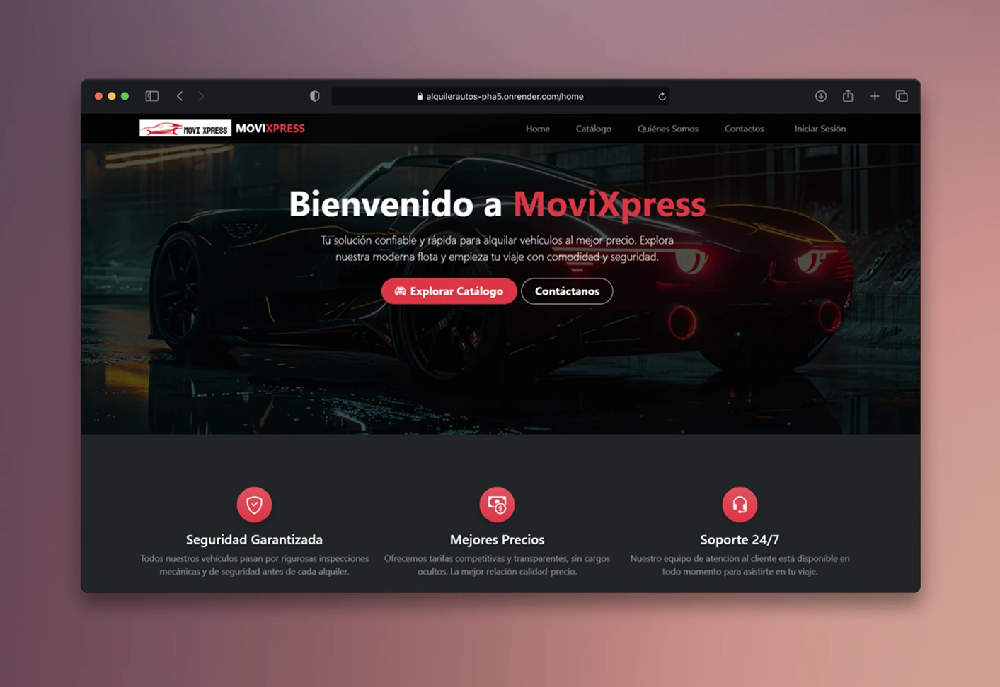

# MoviXpress – Vehicle Rental System




---

## Overview

MoviXpress is a complete vehicle rental management platform built with **Spring Boot**.  
It provides a modern public website and a full administration panel for managing vehicles, clients, rentals, and company configuration.

Designed for small and medium-sized rental businesses, it includes:

- Vehicle inventory control
- Client management
- Rental creation and monitoring
- Automatic penalty calculations
- Cloud image storage with Cloudinary
- Configurable business data
- Secure authentication with user roles (ADMIN, WORKER)

---

## Features

### User Management

- Login system secured with Spring Security
- Roles: **ADMIN** and **WORKER**

### Vehicle Management

- Register and edit vehicles
- Upload images using Cloudinary
- Manage brands, types, capacities, fuel types, transmissions, and mileage ranges

### Client Management

- Register and track clients
- Access rental history

### Document Management

- Configurable document types (invoice, receipt, etc.)

### Rental Management

- Create rental orders
- Automatic penalty calculation
- Price handling based on vehicle configuration

### Business Configuration

- Company information
- Contact details
- Branding and general settings

### Public Website

- Home
- Vehicle catalog
- About us
- Contact form with business info and map

---

## Technologies Used

- **Java 17**
- **Spring Boot** (Security, Web, JPA, Validation)
- **MySQL**
- **Hibernate**
- **Cloudinary**
- **Thymeleaf**
- **Bootstrap 5**
- **Docker & Docker Compose**
- **Lombok**

---

## Running with Docker Compose

This project includes a fully reproducible development environment using Docker.

### Clone the repository

```bash
git clone https://github.com/ClaudioCh-Dev/movixpress
cd movixpress
```

### Configure the `.env` file

Copy the example file:

```bash
cp .env.example .env
```

Then edit the Cloudinary and database values:

```properties
SPRING_DATASOURCE_URL=jdbc:mysql://movixpress-db:3306/movixpress?createDatabaseIfNotExist=true
SPRING_DATASOURCE_USERNAME=root
SPRING_DATASOURCE_PASSWORD=yourpassword

CLOUDINARY_CLOUD_NAME=your_cloud_name
CLOUDINARY_API_KEY=your_api_key
CLOUDINARY_API_SECRET=your_api_secret
```

⚠️ **The `.env` file is ignored by Git and must not be committed.**

### Build and start the system

```bash
docker-compose up --build
```

The application will be available at:

```
http://localhost:8080
```

---

## Database Initialization

When Docker starts, MySQL is automatically populated using the SQL scripts:

```
/database/
├── 01-schema.sql   → Table structure
└── 02-data.sql     → Initial data
```

### Key Tables

- clientes
- usuarios
- vehiculos
- alquiler
- configuracion
- marcas, tipos, capacidades, combustible, transmisión, kilometraje
- documentos

---

## Default Admin User

```text
Username: admin
Password: contra123
```

Password is hashed using BCrypt.

---

## Project Structure

```text
.
├── database/
│   ├── 01-schema.sql
│   └── 02-data.sql
├── docker-compose.yml
├── Dockerfile
└── src/
    └── main/
        ├── java/proyectosCibertec/com/
        └── resources/
            ├── static/
            ├── templates/
            └── application.properties
```

---

## Development Notes

- CSS consolidated into:

  - `static/css/global.css`
  - `static/css/client.css`
  - `static/css/admin.css`

- Scripts organized:

  - `static/js/global/`
  - `static/js/admin/`
 
---
